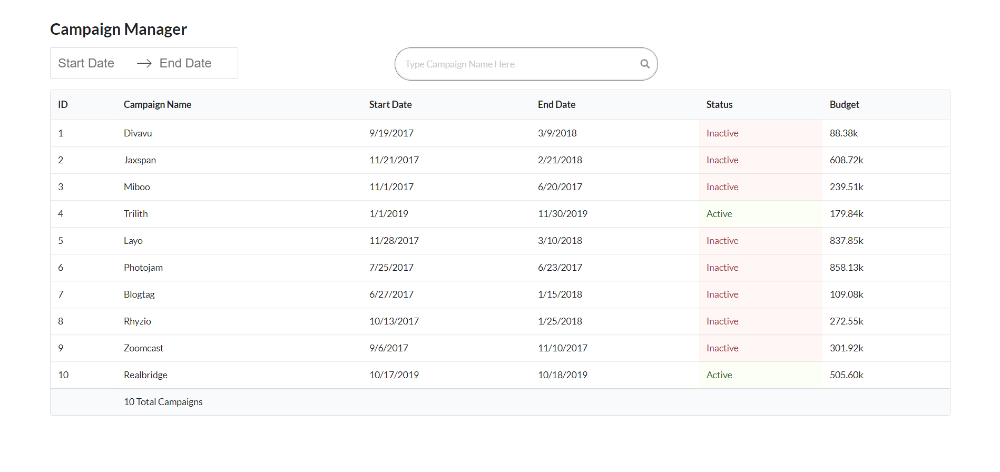

# Campaign Manager

This is a simple campaign manager, implemented with React, Next.js, Typescript and other helpful packages as part of a coding challenge.
[Visit Live Site Here.](https://campaign-manager.now.sh)

#

[](https://campaign-manager.now.sh)

#

### The Challenge Requirements

The application should be a simple page with the following elements:

1. A list of Campaign which shows

- The Name
- The startDate
- The endDate
- A flag to state if the Campaign is active (a campaign is running when the current date is inside the start-end date range)
- The Budget (in USD dollar)

2. A Search Form before the list in order to filter the list by Campaign Name
3. A DateRange component that filters the list of campaigns based on a Start and End Date.
4. If the campaign has a startDate that is contained in the range, it should show
5. If the campaign has an endDate that is contained in the range, it should show.
6. You should not be able to select an end-date that is before the start-date.
7. If the endDate is before the start Date, the campaign should not show.

_Also, The candidate will expose a global method called &#39;AddCampaigns&#39; that takes an array of Campaigns and will render them.
This function will be invoked from the browser’s JavaScript console for testing purposes. If it cannot be invoked, the submission will be rejected.
The method is allowed to be called multiple times. If so, the new campaigns will append to the existing list.
Example of campaign array that can be passed:_

```js
;[
  {
    id: 1,
    name: 'Divavu',
    startDate: '9/19/2017',
    endDate: '3/9/2018',
    Budget: 88377,
  },
  {
    id: 2,
    name: 'Jaxspan',
    startDate: '11/21/2017',
    endDate: '2/21/2018',
    Budget: 608715,
  },
]
```

### Features

0. Typescript
1. Uses modern ES6-ES7 syntax
1. React for UI
1. React Hooks for state management
1. Next.js for Server Side Rendering, Fast loading, Automatic code Splitting, Styling with JS.
1. Clean, tidy and well commented code
1. Snapshot Testing with Jest
1. Easily deployable
1. Linted with Prettier, Eslint, Tslint, etc.

#

### Tech Stack

- React.js
- Next.js
- Typescript
- Semantic UI
- Numbro
- Date-fns
- React Dates (by Airbnb)

#

### Linting and Formatting

- Prettier
- Eslint

#

### Running Locally (Dev Env)

Follow these steps to run the web app on your local machine

1. Open up your terminal and type: `git clone https://github.com/nfuad/campaign-manager.git`
2. Then enter into the cloned repo from the terminal using: `cd campaign-manager` (assuming the directory name wasn't changed while cloning)
3. Then type: `yarn` to install all the dependencies
4. When the installation is complete, type: `yarn dev`
5. The web app will open up on the default browser

OR,
Run with Docker.

#

### Available Commands / Script Tasks

- `yarn dev` - To start the local development environment
- `yarn build` - To build for production using `next build` command
- `yarn start` - To start in production mode using `next start`
- `yarn test` - To test using jest.

#

### Live Demo

Check out the live demo here:
[https://campaign-manager.now.sh](https://campaign-manager.now.sh)

#

### Bug Report

If you found any bug and want to report it, you can definitely [open a new issue here.](https://github.com/nfuad/campaign-manager/issues)

#

### License

[MIT](/LICENSE.md)
